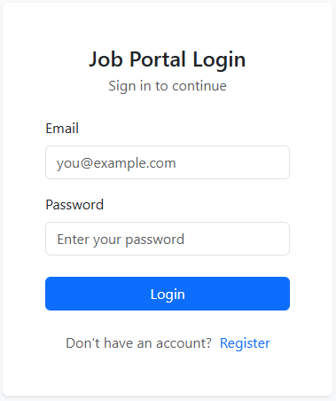
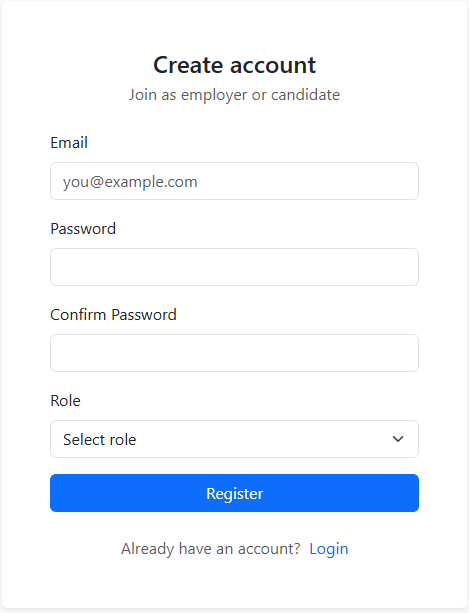
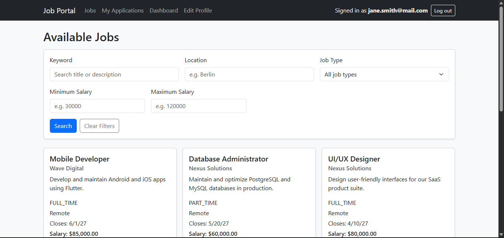
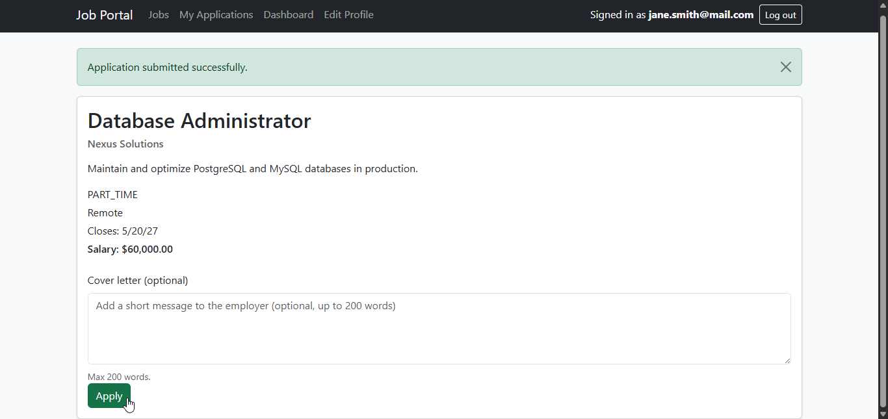
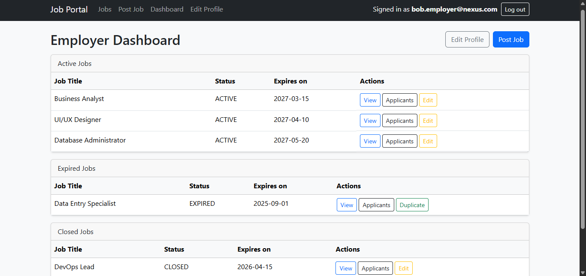
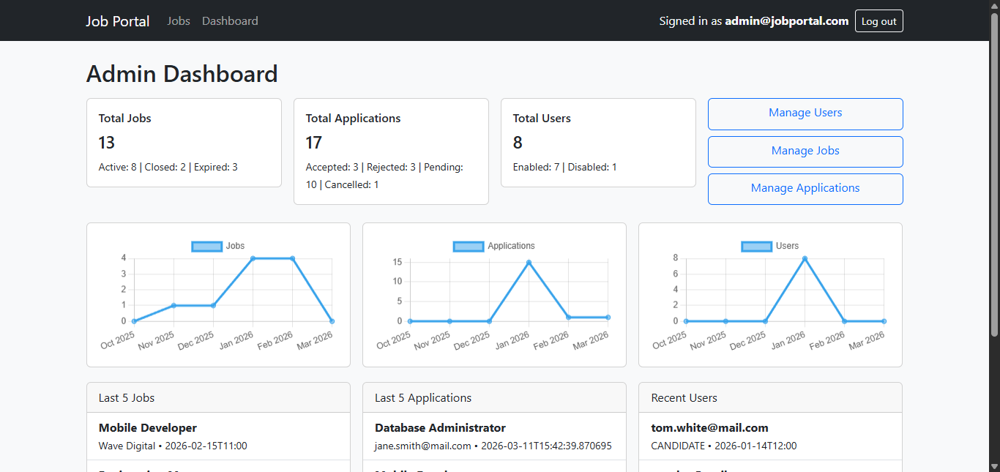

# Job Portal

A Spring Boot job portal where **candidates** apply to jobs, **employers** manage postings and applications, and **admins** monitor jobs, applications, and users.

## Table of Contents

- [Screenshots](#screenshots)
- [Tech Stack](#tech-stack)
- [Prerequisites](#prerequisites)
- [Project Setup](#project-setup)
- [Running Locally](#running-locally)
- [Running with Docker](#running-with-docker)
- [Authentication & Authorization](#authentication--authorization)
- [Dashboards & Workflows](#dashboards--workflows)
- [Job & Application Status Rules](#job--application-status-rules)
- [Role Restrictions & Protected Actions](#role-restrictions--protected-actions)
- [REST Endpoints](#rest-endpoints)
- [Testing](#testing)

---

## Screenshots

### Login & Registration



### Candidate — Job Search


### Candidate — Job Details & Application


### Employer Dashboard


### Admin Dashboard


---

## Tech Stack

- Java 21
- Spring Boot (MVC, Security, Data JPA, Validation, Thymeleaf)
- MySQL (primary runtime database)
- H2 (test profile)
- Maven

---

## Prerequisites

Ensure the following are installed:

| Tool    | Minimum Version |
|---------|-----------------|
| JDK     | 21+             |
| Maven   | 3.9+            |
| MySQL   | 8+              |

Verify installed versions:

```bash
java -version
mvn -version
mysql --version
```

---

## Project Setup

### 1. Clone the repository

```bash
git clone https://github.com/alnar05/Job-Portal.git
cd Job-Portal
```

### 2. Create the database

The application expects a MySQL database named `job_portal`.

Default datasource configuration:

```properties
spring.datasource.url=jdbc:mysql://localhost:3306/job_portal
spring.datasource.username=springstudent
spring.datasource.password=springstudent
```

To create the database and user:

```sql
CREATE DATABASE job_portal;

CREATE USER 'springstudent'@'localhost' IDENTIFIED BY 'springstudent';
GRANT ALL PRIVILEGES ON job_portal.* TO 'springstudent'@'localhost';
FLUSH PRIVILEGES;
```

### 3. Configure application properties

Edit `src/main/resources/application.properties` to override any defaults:

- `spring.datasource.url`
- `spring.datasource.username`
- `spring.datasource.password`
- `spring.jpa.hibernate.ddl-auto` (currently set to `update`)

---

## Running Locally

```bash
mvn spring-boot:run
```

Once started, the following pages are available:

| Page             | URL                              |
|------------------|----------------------------------|
| Home             | http://localhost:8080/           |
| Login            | http://localhost:8080/login      |
| Registration     | http://localhost:8080/register   |

---

## Running with Docker

Docker Compose spins up both the application and a MySQL database together - no local MySQL installation required.

### Prerequisites

| Tool           | Minimum Version |
|----------------|-----------------|
| Docker         | 24+             |
| Docker Compose | 2.20+           |

### 1. Build and start all services

```bash
docker compose up --build
```

This will:
- Build the application image using the multi-stage `Dockerfile`
- Start a MySQL 8 container (`job_portal_db`)
- Wait for the database to be healthy before starting the app
- Expose the app at `http://localhost:8080`

### 2. Run in detached mode

```bash
docker compose up --build -d
```

### 3. Stop all services

```bash
docker compose down
```

To also remove the database volume (wipes all data):

```bash
docker compose down -v
```

### Environment variables

The app container is configured via environment variables in `docker-compose.yml`. Override them without editing the file by using a `.env` file in the project root:

```env
MYSQL_USER=springstudent
MYSQL_PASSWORD=springstudent
MYSQL_ROOT_PASSWORD=rootpassword
```

> **Note:** For production deployments, never commit real credentials. Use Docker secrets or your platform's secrets manager instead.

### Useful commands

```bash
# Tail application logs
docker compose logs -f app

# Tail database logs
docker compose logs -f db

# Open a MySQL shell inside the container
docker compose exec db mysql -u springstudent -pspringstudent job_portal
```

---

## Authentication & Authorization

The application uses form-based login.

| Access Level        | Routes                                      |
|---------------------|---------------------------------------------|
| Public              | `/login`, `/register`, static assets        |
| Authenticated users | Main app pages, `/api/**`                   |
| Admin only          | `/admin/**`, admin dashboard                |

**Roles:**

- `ADMIN`
- `EMPLOYER`
- `CANDIDATE`

Registration is restricted to `EMPLOYER` and `CANDIDATE` roles. Admin accounts are not created through the public registration flow.

---

## Dashboards & Workflows

### Candidate

**Primary pages:**
- `/dashboard/candidate`
- `/jobs` — search and list jobs
- `/jobs/{id}` — job details and application
- `/applications/my`
- `/applications/{id}` — own application details
- `/profile/edit`

**Typical flow:**
1. Register as `CANDIDATE`.
2. Browse and filter jobs (`/jobs`) by keyword, location, type, or salary range.
3. Open a job details page and submit an application (optional cover letter).
4. Track application status changes from the dashboard or My Applications page.

---

### Employer

**Primary pages:**
- `/dashboard/employer` (also `/employer/dashboard`)
- `/jobs/create`
- `/jobs/edit/{id}`
- `/jobs/{id}/duplicate`
- `/applications/job/{jobId}`
- `/applications/{id}`
- `/profile/edit`

**Typical flow:**
1. Register as `EMPLOYER`.
2. Create job postings.
3. Manage own jobs (edit, delete, or duplicate).
4. Review candidate applications for own jobs.
5. Accept or reject applications.

---

### Admin

**Primary pages:**
- `/dashboard/admin`
- `/admin/jobs`
- `/admin/applications`
- `/admin/users`
- `/admin/users/{id}`

**Typical flow:**
1. View platform-wide metrics from the admin dashboard.
2. Filter jobs, users, and applications.
3. Perform bulk updates:
    - Job status: bulk reopen/close (expired jobs excluded)
    - Application status: bulk updates
    - User accounts: bulk enable/disable
4. Manage user lifecycle (admin accounts are protected from mutation/deletion).

---

## Job & Application Status Rules

### Job status

| Status    | Description                              |
|-----------|------------------------------------------|
| `ACTIVE`  | Visible and open to candidates           |
| `CLOSED`  | Manually closed by employer or admin     |
| `EXPIRED` | Closing date has passed                  |

**Rules:**
- A job becomes `EXPIRED` automatically when its closing date passes.
- Expired jobs are immutable: they cannot be edited and are excluded from bulk reopen/close actions.
- Employers should use **Duplicate** to repost an expired job.
- Candidate job browsing and search is limited to active, non-expired jobs.

### Application status

| Status      | Description                                          |
|-------------|------------------------------------------------------|
| `APPLIED`   | Submitted by candidate, awaiting review              |
| `REVIEWED`  | Opened by employer or admin                          |
| `ACCEPTED`  | Accepted by employer                                 |
| `REJECTED`  | Rejected by employer                                 |
| `CANCELLED` | Withdrawn or cancelled                               |

**Rules:**
- A candidate may apply to each job only once.
- Applying to expired jobs is blocked.
- Opening an application as an employer or admin automatically transitions `APPLIED` to `REVIEWED`.
- `ACCEPTED`, `REJECTED`, and `CANCELLED` are final and immutable from accept/reject actions.

---

## Role Restrictions & Protected Actions

| Role        | Permissions                                                  |
|-------------|--------------------------------------------------------------|
| `CANDIDATE` | Apply to jobs; view own applications only                    |
| `EMPLOYER`  | Manage own job postings and their associated applications    |
| `ADMIN`     | Platform-level management of jobs, applications, and users   |

Admin accounts are protected from mutation or deletion by other admin management actions.

---

## REST Endpoints

All endpoints require authentication. Authorization is enforced in the service and controller layers via role and ownership checks.

### Jobs — `/api/jobs`

| Method   | Endpoint                       | Description                  |
|----------|--------------------------------|------------------------------|
| `GET`    | `/api/jobs`                    | List all jobs                |
| `GET`    | `/api/jobs/search`             | Search/filter jobs           |
| `GET`    | `/api/jobs/{id}`               | Get job by ID                |
| `GET`    | `/api/jobs/employer/{id}`      | Get jobs by employer         |
| `POST`   | `/api/jobs`                    | Create a job                 |
| `PUT`    | `/api/jobs/{id}`               | Update a job                 |
| `DELETE` | `/api/jobs/{id}`               | Delete a job                 |

### Applications — `/api/applications`

| Method   | Endpoint                              | Description                       |
|----------|---------------------------------------|-----------------------------------|
| `GET`    | `/api/applications`                   | List all applications             |
| `GET`    | `/api/applications/{id}`              | Get application by ID             |
| `POST`   | `/api/applications`                   | Submit an application             |
| `GET`    | `/api/applications/candidate/{id}`    | Get applications by candidate     |
| `GET`    | `/api/applications/job/{jobId}`       | Get applications for a job        |
| `DELETE` | `/api/applications/{id}`              | Delete an application             |

---

## Testing

Run all tests:

```bash
mvn test
```

Run a specific test class:

```bash
mvn -Dtest=JobServiceImplTest test
```

Tests use an H2 in-memory database configured in `src/test/resources/application-test.properties`, with `ddl-auto` set to `create-drop`.